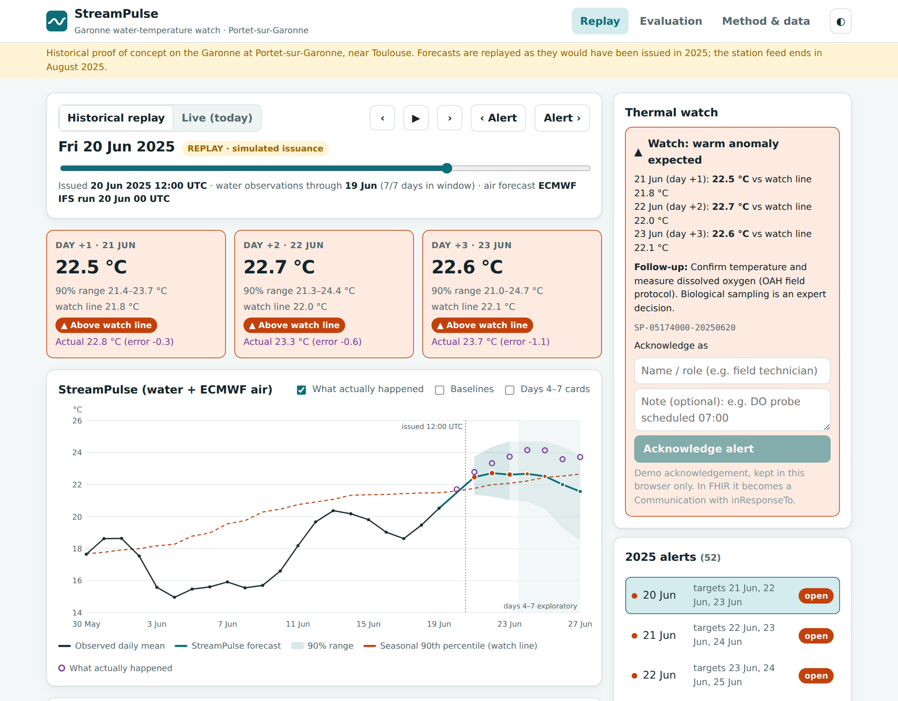
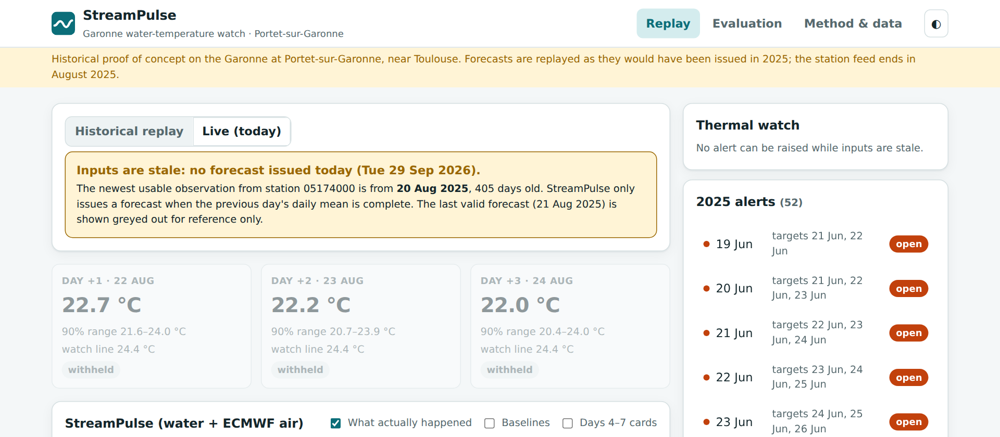
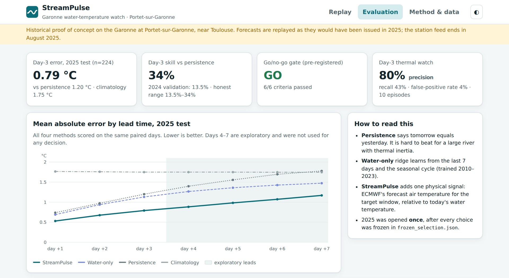
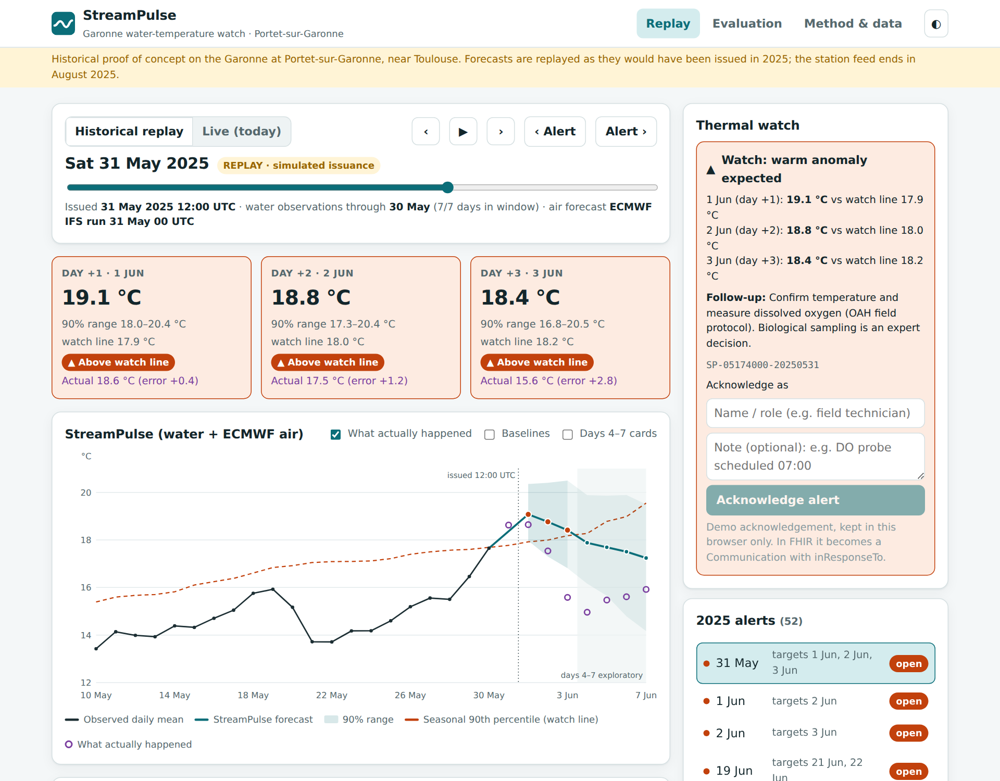

# StreamPulse

**Leakage-safe 1–3 day forecasts of river water temperature, turned into field alerts that follow the OneAquaHealth protocol and are recorded as HL7 FHIR.**

Historical proof of concept on the Garonne at Portet-sur-Garonne, near Toulouse (Hub'eau station `05174000`).

**[Live replay dashboard](https://mohitt31.github.io/streampulse/)** · [Video (4:30)](#) · OneAquaHealth IEEE Global Hackathon 2026 · Track 6 (primary) and Track 7 (interoperability)



## Why

Warm water holds less dissolved oxygen, and heat stress in urban rivers hurts fish, invertebrates and the people who use the water. Monitoring teams cannot sample every day at every site. StreamPulse answers one practical question each morning: **will the river run unusually warm in the next three days, and should someone go out and measure oxygen?**

## What it does

Every day at 12:00 UTC, using only data available at that moment:

1. Forecasts the **daily mean water temperature** for days +1, +2 and +3, with a 90% range.
2. Flags a **thermal watch** when a forecast reaches that calendar day's **90th percentile** (2010–2023, ±15-day window).
3. Turns a watch into a concrete field task: **confirm temperature and measure dissolved oxygen** (OAH field protocol). Whether to add biological sampling is left to an expert.
4. Records the forecast, the alert, its acknowledgement and full provenance as **FHIR R4 resources conforming to the OneAquaHealth IG**.

The dashboard replays 2025 day by day, exactly as forecasts would have been issued. In **Live** mode it refuses to forecast, because the station feed stopped on 2025-08-21. It shows a stale-input state instead of a made-up number.



## Results (2025 test, opened once)

All methods are scored on the **same 224 paired days** (1 Jan–21 Aug 2025). The design, splits and thresholds were fixed in [`config/contract.toml`](config/contract.toml) before 2025 was touched.

| Lead | StreamPulse | Water-only ridge | Persistence | Climatology | Skill vs persistence |
|---|---:|---:|---:|---:|---:|
| +1 | **0.53** | 0.69 | 0.74 | 1.76 | 28% |
| +2 | **0.68** | 0.94 | 0.97 | 1.76 | 31% |
| **+3** | **0.79** | 1.13 | 1.20 | 1.75 | **34%** |
| +4 to +7 (exploratory) | 0.88–1.17 | 1.27–1.47 | 1.40–1.78 | 1.75 | 34–37% |

Mean absolute error in °C. Skill = 1 − MAE / MAE(persistence).

**Pre-registered go/no-go gate (day 3): 6/6 passed → GO**

| # | Criterion | Result |
|---|---|---|
| 1 | ≥120 paired days, ≥60 in May–Aug | 224, 107 |
| 2 | Skill ≥ 10% | 34.1% |
| 3 | MAE gain ≥ max(0.10 °C, 10% of 2024 persistence MAE) = 0.118 °C | 0.41 °C |
| 4 | 95% moving-block bootstrap lower bound > 0 (blocks never cross gaps) | 14-day [0.19, 0.64] · 28-day [0.15, 0.69] |
| 5 | Beats climatology overall and persistence in May–Aug | 0.79 vs 1.75 · 0.78 vs 1.32 |
| 6 | Chronology assertions pass; 24 h data delay keeps skill | all pass · 38.5% |

**Thermal watch**

| Lead | TP | FP | FN | TN | Precision | Recall | 90% interval coverage |
|---|---:|---:|---:|---:|---:|---:|---:|
| +1 | 42 | 7 | 16 | 161 | 86% | 72% | 95% |
| +2 | 35 | 6 | 22 | 162 | 85% | 61% | 95% |
| +3 | 24 | 6 | 32 | 162 | 80% | 43% | 98% |

When it raises a watch it is usually right. At day 3 it misses more than half of warm-anomaly days. The test window holds 10 observed exceedance episodes, so treat these rates as indicative.



### What we do not claim

- **2024 validation skill was 13.5%; 2025 test skill is 34%.** The hot 2025 summer probably made the air-temperature signal unusually useful. Expect somewhere in that range, not 34% every year.
- **One station, one river.** This is a historical proof of concept, not an operational service.
- **The 90% intervals are too wide.** They cover 95–98% instead of 90%, because they were calibrated on 2024 residuals.
- **Day-3 bias is −0.40 °C.** 2025 ran warmer than the model expected.
- **ECMWF inputs are archived runs** from the Open-Meteo Single Runs API. Early coverage may be reprocessed hindcasts, so this is a *reforecast evaluation*.
- **A failure case we show on purpose.** On 31 May 2025 the model forecast 18.4 °C for 3 June; the river dropped to 15.6 °C. Nothing in its inputs could see that cooling coming, and river flow is not yet a feature.



## How it works

```
Hub'eau hourly sensor ─► QC ─► daily mean ─► trailing features ─► ridge per lead (+1…+7)
                                                                    │
ECMWF IFS 00 UTC run (Open-Meteo Single Runs) ─► air mean D+1…D+h ─►+ a_h + b_h·(air − water)
                                                                    │
                           empirical 5/95% interval ◄───────────────┤
                           watch if ≥ seasonal p90 ─► alert ─► FHIR Bundle
```

- **Target:** daily mean water temperature on the source calendar day.
- **QC:**
  - A day needs ≥18 unique hourly readings and at least one reading in every 6-hour quarter.
  - Identical duplicates are collapsed; conflicting duplicates are quarantined.
  - Gaps are never interpolated.
- **Water model:** one direct ridge regression per lead, predicting `y(T) − last`.
  - Features: last value, 3- and 7-day means, 3-day change, seasonal sin/cos, and the training climatology minus the last value.
  - Standardised on training data only. α chosen on 2023, then refit on 2010–2023.
- **Weather correction:** `ŷ = ŷ_water + a_h + b_h · (mean ECMWF 2 m air temperature over D+1…D+h − last water value)`, using run D 00 UTC, which is available before the 12:00 UTC issuance.
  - Chosen against water-only on 2024 with an expanding window. Each month is predicted with coefficients fitted only on targets observed before it.
  - An intercept-only ablation is reported but can never be selected.
- **Leakage controls:**
  - A row belongs to a split only if both its issue date and its target date lie inside it.
  - All windows are trailing.
  - `validate` never reads 2025. `test` records the hash of the frozen selection in `reports/test_lock.json`, and the CLI refuses to re-validate or re-test with a changed selection unless `--reopen` is passed, which is logged.
  - Eight chronology assertions run on every forecast row.

### A data finding: the source clock is French local time

Hub'eau does not document the timezone of `heure_mesure_temp`. The data answers it: on the spring daylight-saving Sunday of **every** year on record, 02:00 is missing and 03:00 appears twice (24 quarantined readings, 12 years). The clock is therefore Europe/Paris civil time. A local calendar day ends at 22:00 or 23:00 UTC, well before the 12:00 UTC issuance, so the previous day is always complete when a forecast is made.

## Interoperability (FHIR, Track 7)

<!-- Update this section once the FHIR workstream is merged: fill in validator output and negative-control results. -->
- **Site:** `LocationOah`.
- **Measurements:** `ObservationIndicatorsOah`, in UCUM `Cel`.
- **Forecasts:** a local forecast Observation profile derived from it, carrying the 90% interval, the forecast origin, the run mode (`replay`/`operational`) and the real generation time.
- **Alerts:** a `Communication` about the Location and the forecasts. Acknowledgement uses `inResponseTo`.
- **Provenance:** a `Provenance` resource plus a model `Device`.
- **Pinned versions:** OAH IG commit `b907cf0`, FHIR 4.0.1, official HL7 validator.

`RiskAssessment` is deliberately not used: in R4 its subject must be a Patient or Group. See [`fhir/`](fhir/) for profiles, examples, negative controls and validation reports.

## Data

| Source | Use | Licence |
|---|---|---|
| [Hub'eau water temperature API](https://hubeau.eaufrance.fr/page/api-temperature-continu) | Hourly water temperature, station 05174000, 2010 → 2025-08-21 | Etalab Open Licence 2.0 |
| [Open-Meteo Single Runs API](https://open-meteo.com/en/docs/single-runs-api) | ECMWF IFS 00 UTC runs, hourly `temperature_2m`, 8 days, 523 runs 2024-03-14 → 2025-08-22 | CC BY 4.0 |

**Coverage:**
- 4,527 of 5,712 calendar days are usable.
- The station has no data from August 2018 to January 2021, and 2014 is mostly missing.
- Four ECMWF runs are missing (5, 6, 8 and 9 Aug 2025). The 7 Aug 2025 run returned all nulls.

These days are excluded from scoring. In the dashboard they fall back to the labelled water-only model.

Every download is logged with URL, time, row count and SHA-256 in `data/manifests/`. Details are in [DATA_SOURCES.md](DATA_SOURCES.md).

## Reproduce

```bash
pip install -e ".[dev]"
python3 scripts/fetch_hubeau.py         # ~16 requests
python3 scripts/fetch_single_runs.py    # ~525 requests, ~20 min, resumable
streampulse all                         # ingest → validate → test → gate
pytest -q                               # QC, leakage, model and end-to-end tests
python3 scripts/build_web_data.py && cd web && npm ci && npm run dev
```

No network? Run `streampulse synth --root /tmp/sp && streampulse all --root /tmp/sp`. It runs the whole pipeline on synthetic data, and every output is stamped SYNTHETIC.

## Repository

```
config/contract.toml      frozen evaluation contract (hash recorded in every report)
scripts/                  fetchers (stdlib only), web data packer
src/streampulse/          quality, features, baselines, model, backtest, gate, cli
reports/                  frozen_selection, test_metrics, gate, chronology, forecasts.jsonl, alerts.jsonl
fhir/                     FHIR profiles, examples, validation
web/                      React + TypeScript replay dashboard (no chart library)
tests/                    pytest suite, run in CI
```

## Next steps

- Connect a live sensor feed. The pipeline already runs operationally; only fresh data is missing.
- Add river discharge (Hub'eau hydrometry) to capture flow-driven cooling like the 31 May case.
- Calibrate the watch line with local ecologists, for example species-specific absolute thresholds.
- Onboard more stations. A new site needs only a station code, coordinates and its own climatology.

## Licence

MIT for code. Data keep their original licences (see above).
